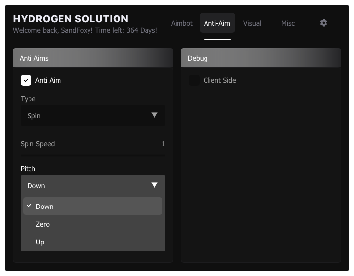

 

  
   
   
   

> [!IMPORTANT]
> This project was never intended to be maintained.
> 
> There is no Anti-Aims because i want to.
> Cheat currently on auto update and probably detected.

# About

A small project that has become almost the most popular cheat on SCP:SL. Initially updated manually and IL2CPP was not provided. Good luck using IL2CPP resolver somewhere other than engine.cpp

A bunch of shit code

And also no menu so cry about it

# Features

## Aimbot
* Silent Aim
* Fov
* Auto fire
* Idk

## ESP
* Basic esp
* Chams
* Rooms / Items ESP

## Misc
* Anti tesla
* Noclip
* And others

# Detection

Cheat is probably detected cuz:
* Too much hooks
* Imgui
* String

# Credits

* [SandFoxy](https://github.com/SandFoxy) Made the whole cheat (its me lol)
* [chaseplays](https://www.unknowncheats.me/forum/members/2769677.html) Thanks for help with features and other
